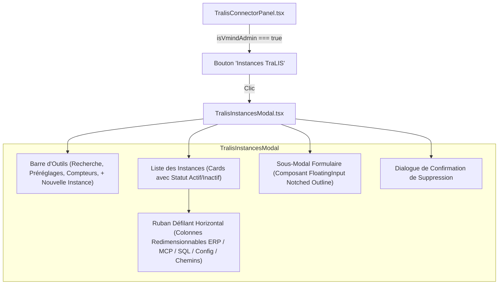

# Interface de Gestion des Instances TraLIS
## Spécification Ergonomique, Fonctionnelle & Technique

---

### 1. Présentation & Objectifs de l'Interface

L'interface **Instances TraLIS** est un module d'administration intégré au panneau de configuration des connecteurs ([`TralisConnectorPanel.tsx`](file:///c:/Users/melek/Desktop/Vmind_Front/features/connectors/components/TralisConnectorPanel.tsx)). Développée selon les standards visuels de la plateforme VMIND, elle permet aux administrateurs autorisés de superviser, configurer et administrer l'ensemble des environnements clients (*tenants*) connectés à TraLIS.

```
┌─────────────────────────────────────────────────────────────────────────────┐
│  VMIND Connecteurs > TraLIS MCP                                             │
│  [Logo TraLIS]  TraLIS MCP                                                  │
│                 Connecté — host · Tenant SMTI   [Instances TraLIS] [Déconn.]│
└─────────────────────────────────────────────────────────────────────────────┘
```

#### 1.1 Objectifs Clés
- **Centralisation :** Un point d'entrée unique pour visualiser l'ensemble des instances déployées.
- **Lisibilité :** Affichage optimisé des paramètres techniques longs (URLs ERP et MCP, serveurs SQL, chemins disques) sans tronquer ni casser la mise en page.
- **Ergonomie moderne :** Intégration de champs de saisie à labels flottants (*Notched Outline*) conformes aux designs industriels de pointe.
- **Sécurité stricte :** Restriction d'accès exclusive aux comptes administrateurs VMIND, tant au niveau visuel qu'au niveau des appels API.

---

### 2. Architecture des Composants Frontend

L'architecture s'articule autour de deux fichiers majeurs :
1. **[`TralisConnectorPanel.tsx`](file:///c:/Users/melek/Desktop/Vmind_Front/features/connectors/components/TralisConnectorPanel.tsx) :** Panneau parent gérant l'état de connexion au connecteur et conditionnant l'accès au modal.
2. **[`TralisInstancesModal.tsx`](file:///c:/Users/melek/Desktop/Vmind_Front/features/connectors/components/TralisInstancesModal.tsx) :** Composant modal autonome encapsulant la liste, les filtres, le ruban redimensionnable, le formulaire d'ajout/modification et la confirmation de suppression.



---

### 3. Fonctionnalités Détaillées de l'Interface

#### 3.1 Barre d'Outils & Recherche en Temps Réel
La barre d'outils supérieure regroupe les fonctions de pilotage rapide :
- **Recherche instantanée :** Filtrage en direct au fil de l'eau sur 4 critères simultanés (`client_id`, `display_name`, `db_database`, `erp_url`).
- **Indicateurs chiffrés :** Badges synthétiques affichant le nombre total d'instances enregistrées et le nombre d'instances en statut actif.
- **Préréglages de colonnes :** 4 boutons permettant d'adapter la largeur des colonnes à la résolution d'écran :
  - `Compact` : Largeurs resserrées idéales pour écrans d'ordinateurs portables.
  - `Standard` : Répartition équilibrée par défaut.
  - `Large` : Affichage étendu pour écrans larges / moniteurs haute résolution.
  - `Réinitialiser` (icône rotative) : Rétablit les largeurs d'origine.
- **Bouton d'action « + Nouvelle Instance » :** Déclenche l'ouverture du formulaire de création.

#### 3.2 Ruban Horizontal Défilant & Redimensionnement Manuel
Pour résoudre le problème des URLs longues qui débordaient ou cassaient les grilles précédentes, les propriétés de chaque instance sont désormais logées dans un **ruban horizontal à défilement fluide** (`overflowX: 'auto'`) :
- Chaque bloc technique (`ERP`, `MCP`, `SQL`, `Config`, `Chemins`) dispose d'une poignée de redimensionnement manuel située sur sa bordure droite.
- **Interaction à la souris :** L'utilisateur peut cliquer et glisser (`handleStartResize`) pour agrandir ou réduire une colonne spécifique (largeur configurable de 90px à 800px).
- **Troncature automatique :** Lorsque la colonne est rétrécie, le texte est tronqué proprement avec des points de suspension (`textOverflow: 'ellipsis'`).
- **Infobulle complète :** Le survol de la souris sur n'importe quel texte tronqué révèle immédiatement la valeur intégrale via l'attribut natif `title`.

#### 3.3 Formulaire de Saisie avec Labels Flottants (*Notched Outline*)
Le formulaire d'ajout et de modification utilise le composant custom `FloatingInput` qui reproduit le comportement des interfaces professionnelles :
- **État Vide / Non focalisé :** Le label est centré verticalement à l'intérieur du champ avec une typographie discrète (`#64748B`).
- **État Saisi ou Focalisé :** Le label s'anime vers le haut pour venir se positionner exactement à cheval sur la bordure supérieure (`top: -8px`).
- **Masque d'arrière-plan opaque :** Un arrière-plan identique à la couleur de surface du modal (`#081226`) masque la bordure derrière le label, créant une encoche parfaite sans coupure visuelle.
- **Bouton de visibilité mot de passe :** Une icône œil (`Eye` / `EyeOff`) permet de basculer la visibilité du mot de passe SQL sans jamais l'exposer par inadvertance.

#### 3.4 Structuration Logique en 4 Sections Métier
Les champs du formulaire sont organisés en quatre blocs ordonnés :
1. **Section 1 : Identité & Affichage**
   - `Identifiant Tenant (Client ID)` : Clé unique (ex: `CLIENT1`, `SMTI`). Obligatoire.
   - `Nom d'Affichage` : Nom usuel de l'organisation. Obligatoire.
2. **Section 2 : Accès Réseau & Connectivité**
   - `URL de l'ERP TraLIS` : Adresse web de l'ERP (ex: `http://localhost`, `https://prod.smti.fr`). Obligatoire.
   - `URL Serveur MCP` : Endpoint du serveur MCP dédié (ex: `https://localhost:3002/mcp`). Obligatoire.
3. **Section 3 : Connexion Microsoft SQL Server**
   - Ligne 1 : `Serveur Hôte SQL` + `Port TCP` (défaut : `1433`).
   - Ligne 2 : `Base Métier` (ex: `TUNISHIP_DATA_07`) + `Base de Configuration DNN` (défaut : `TMS_Config`).
   - Ligne 3 : `Utilisateur SQL` + `Mot de passe SQL` (requis à la création, optionnel à la modification si inchangé).
4. **Section 4 : Chemins Fichiers & Répertoires (Optionnels)**
   - `Chemin Répertoire VD` : Emplacement des rapports d'exploitation.
   - `Chemin Répertoire E255` : Emplacement des pièces jointes et archives.

---

### 4. Système de Validation & Gestion des Erreurs

#### 4.1 Suppression des Infobulles Natives du Navigateur
L'attribut `noValidate` est positionné sur la balise `<form>`, désactivant totalement les infobulles grises par défaut du navigateur (qui affichaient des messages impersonnels comme *"Veuillez renseigner ce champ"*).

#### 4.2 Surlignage Luminescent des Erreurs
La validation est entièrement contrôlée par le composant React :
- Lorsqu'une soumission est tentée avec des champs obligatoires manquants, l'état `hasAttemptedSubmit` passe à `true`.
- Tout champ obligatoire laissé vide reçoit instantanément la classe d'erreur :
  - Bordure rouge éclatante (`#FF4757`).
  - Lueur diffuse néon rouge (`box-shadow: 0 0 10px rgba(255, 71, 87, 0.25)`).
  - Label coloré en rouge saumon (`#FF6B7A`).
  - Arrière-plan subtilement teinté de rouge (`rgba(255, 71, 87, 0.05)`).
- Dès qu'un caractère est saisi dans le champ, la couleur d'erreur disparaît automatiquement au profit de la surbrillance cyan normale.

#### 4.3 Isolation et Nettoyage des Alertes
Pour éviter qu'une alerte d'erreur de formulaire ne persiste sur la liste des instances après fermeture du modal :
- Deux états distincts sont maintenus : `error` (erreurs réseau/liste) et `formError` (erreurs de validation du formulaire).
- La fonction `handleCloseForm()` réinitialise systématiquement l'ensemble des indicateurs lors d'un clic sur **Annuler**, sur la croix `X`, ou après un enregistrement réussi :
  ```typescript
  const handleCloseForm = () => {
    setShowFormModal(false);
    setFormError(null);
    setHasAttemptedSubmit(false);
    setError(null);
  };
  ```

---

### 5. Sécurité RBAC & Restriction d'Accès Administrateurs

L'accès à cette interface est strictement verrouillé aux seuls comptes détenteurs du rôle administrateur VMIND :

1. **Conditionnement du bouton dans [`TralisConnectorPanel.tsx`](file:///c:/Users/melek/Desktop/Vmind_Front/features/connectors/components/TralisConnectorPanel.tsx) :**
   - La fonction `checkIsVmindAdmin()` décode la session JWT et inspecte la liste des rôles (`Administrator`, `Administrators`, `Admin`, `Superusers`).
   - Le bouton violet **« Instances TraLIS »** n'est présent dans le DOM que si `isVmindAdmin === true`.
2. **Double garde de rendu dans [`TralisInstancesModal.tsx`](file:///c:/Users/melek/Desktop/Vmind_Front/features/connectors/components/TralisInstancesModal.tsx) :**
   - Si un appel est forcé sans droits, le composant retourne `null` immédiatement :
     ```typescript
     if (!isOpen || !checkIsVmindAdmin()) return null;
     ```
   - La fonction `fetchTenants()` bloque également l'envoi de la requête réseau si l'utilisateur n'est pas administrateur.
3. **Contrôle d'accès au niveau du serveur Backend :**
   - Même en cas de manipulation côté client, les endpoints d'administration renvoient systématiquement un code HTTP `401 Unauthorized` ou `403 Forbidden`.

---

### 6. Guide Opérationnel Administrateur

#### 6.1 Créer une Nouvelle Instance
1. Accéder à l'onglet **Connecteurs** puis sélectionner **TraLIS MCP**.
2. Cliquer sur le bouton violet **Instances TraLIS** dans l'en-tête supérieur droit.
3. Dans la barre d'outils du modal, cliquer sur **+ Nouvelle Instance**.
4. Renseigner les informations d'identité (Client ID et Nom d'affichage).
5. Indiquer les URLs de l'ERP et du service MCP.
6. Renseigner les paramètres de connexion SQL Server (serveur, port, base métier, base config DNN, utilisateur et mot de passe).
7. (Facultatif) Définir les chemins locaux des répertoires VD et E255.
8. Cliquer sur **Créer l'instance**. L'environnement est immédiatement disponible en mémoire et prêt à l'emploi.

#### 6.2 Modifier une Instance Existante
1. Repérer l'instance dans la liste ou utiliser la barre de recherche.
2. Cliquer sur l'icône **Crayon (Modifier)** située à droite de la carte de l'instance.
3. Ajuster les paramètres souhaités. Le champ mot de passe peut être laissé vide pour conserver le mot de passe SQL actuel.
4. Valider en cliquant sur **Enregistrer les modifications**.

#### 6.3 Désactiver ou Supprimer une Instance
- **Désactivation temporaire :** Cliquer simplement sur le badge de statut vert **Actif**. Il bascule immédiatement en **Inactif**, coupant l'accès au tenant sans supprimer ses configurations.
- **Suppression définitive :** Cliquer sur l'icône **Poubelle (Supprimer)**. Un dialogue de confirmation s'affiche demandant la confirmation expresse de la suppression. La suppression révoque en cascade toutes les liaisons utilisateurs associées.
