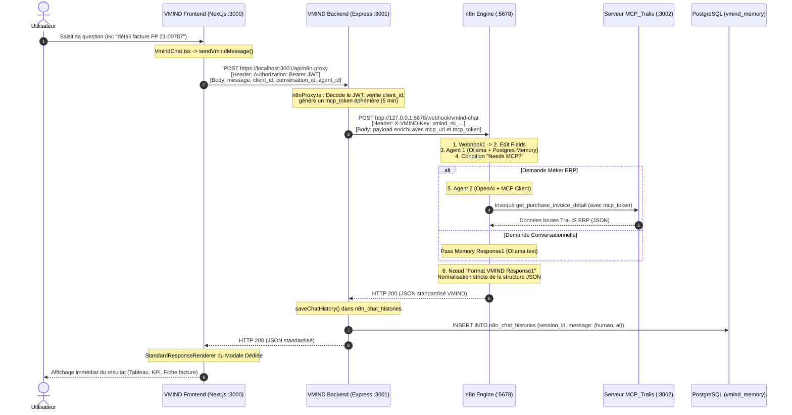

# Architecture et Flux Complet du Chat Assistant VMIND
## Flux : Frontend ➔ Backend ➔ n8n ➔ Backend ➔ Frontend

Ce document décrit en détail le fonctionnement interne, le cycle de vie d'un message utilisateur, les formats de données échangés et les services impliqués dans la chaîne de traitement de l'assistant conversationnel **VMIND**.

---

## 1. Synthèse Exécutive

### Le flux actuel respecte-t-il la stratégie « Frontend ➔ Backend ➔ n8n ➔ Backend ➔ Frontend » ?

**OUI, À 100%.**

Le Frontend n'appelle **jamais** l'instance n8n directement :
1. L'application Next.js (`VMIND_Frontend`) s'adresse exclusivement à l'API du Backend Express (`VMIND_Backend`) via la route sécurisée `POST /api/n8n-proxy`.
2. Le Backend prend en charge l'authentification de l'utilisateur, vérifie les droits d'accès au connecteur ERP (`client_id`), génère un jeton éphémère (`mcp_token` de 5 minutes) et appelle le Webhook n8n (`POST /webhook/vmind-chat`).
3. Le workflow n8n exécute l'orchestration IA (Mémoire LangChain + Agent MCP TraLIS) et renvoie un objet JSON normalisé au Backend via le nœud `Respond to Webhook`.
4. Le Backend réceptionne la réponse de n8n, persiste l'historique dans la table PostgreSQL `n8n_chat_histories`, met à jour la discussion, et renvoie la réponse au Frontend.
5. Le Frontend réceptionne le JSON et déclenche le renderer d'affichage adéquat (Message texte, Tableaux, Graphiques, KPIs, Modale de facture/dossier).

> **Note sur le canvas n8n :**
> La note jaune présente sur le nœud `Webhook1` dans n8n indiquant *"reçoit la requête envoyée par le frontend VMIND"* est une description historique. Dans la réalité du code, c'est bien le Backend Node.js qui effectue l'appel server-to-server vers n8n.

---

## 2. Diagramme de Séquence de Bout en Bout



---

## 3. Cartographie des Fichiers et Rôles par Projet

### A. Côté Frontend (`VMIND_Frontend`)

| Fichier / Module | Rôle et Fonctions Clés |
| :--- | :--- |
| **`components/vmind/VmindChat.tsx`** | Composant principal du chat. <br/>• Capture la saisie via `handleSendMessage(text)`.<br/>• Affiche l'indicateur d'attente animé (*"L'agent réfléchit..."*).<br/>• Reçoit le JSON de réponse et route vers le bon composant de rendu. |
| **`shared/api/n8n-api.ts`** | Client HTTP pour le chat.<br/>• `sendVmindMessage()` : Envoie la requête à `${baseUrl}/api/n8n-proxy`.<br/>• `getAuthHeaders()` : Attache le token JWT de session utilisateur.<br/>• Déballe le résultat si n8n renvoie un tableau d'éléments. |
| **`shared/contexts/ConversationsContext.tsx`** | Gestionnaire d'état React.<br/>• Maintient l'identifiant de la discussion active (`activeConversationId`).<br/>• Réordonne et rafraîchit la liste des conversations (`bumpConversation`). |
| **`components/vmind/renderers/StandardResponseRenderer.tsx`** | Moteur de rendu visuel intelligent.<br/>• Génère automatiquement les tables de données, les graphiques interactifs (Recharts), les cartes KPI et les suggestions d'actions. |

### B. Côté Backend (`VMIND_Backend`)

| Fichier / Module | Rôle et Fonctions Clés |
| :--- | :--- |
| **`src/server-http.ts`** | Point d'entrée HTTP/HTTPS du serveur Express.<br/>• Déclare `app.use('/api', n8nProxyRouter)`.<br/>• Configure les règles CORS et l'écoute sur le port `3001`. |
| **`src/routes/n8nProxy.ts`** | Contrôleur du proxy conversationnel (`POST /api/n8n-proxy`).<br/>• Valide le JWT de l'utilisateur.<br/>• Vérifie dans `vmind_user_connectors` que l'utilisateur a accès au `client_id` demandé.<br/>• Appelle `resolveActiveConnector()` pour récupérer l'URL du serveur MCP TraLIS.<br/>• Génère un jeton signé éphémère (`mcp_token`, validité 5 minutes) injecté dans le payload.<br/>• Effectue le `fetch` vers n8n (`http://127.0.0.1:5678/webhook/vmind-chat`).<br/>• Persiste la question et la réponse via `saveChatHistory()` dans PostgreSQL.<br/>• Renvoie la réponse au Frontend. |
| **`src/conversations.ts`** | API de gestion de l'historique.<br/>• `GET /api/conversations/:conversationId/messages` : Récupère les messages stockés dans `public.n8n_chat_histories` pour recharger la discussion si l'utilisateur change d'onglet. |
| **`src/services/connectorResolver.ts`** | Service de résolution multi-ERP.<br/>• Détermine les paramètres du serveur MCP dédié à l'instance ERP de l'utilisateur (port 3002). |

### C. Côté n8n (Workflow Assistant Chat)

| Nœud n8n | Rôle dans l'Exécution |
| :--- | :--- |
| **1. Webhook1** | Endpoint de réception HTTP (`POST /webhook/vmind-chat`). Reçoit le payload enrichi par le Backend Node.js. |
| **2. Edit Fields** | Prépare et nettoie les champs nécessaires (`message`, `client_id`, `session_id`, `mcp_token`). |
| **3. Agent 1 - Memory1** | LLM local (Ollama) couplé à la mémoire de discussion PostgreSQL (`Postgres Chat Memory`). Analyse la demande et qualifie l'intention. |
| **4. Condition "Needs MCP?"** | Routeur conditionnel :<br/>• **VRAI** : La requête réclame des données ERP fraîches ➔ aiguillage vers **Agent 2 - MCP1**.<br/>• **FAUX** : La requête est conversationnelle ➔ aiguillage vers **Pass Memory Response1**. |
| **5. Agent 2 - MCP1** | Modèle LLM (OpenAI) équipé du nœud **MCP Client**. Invoque l'outil requis (ex: `get_purchase_invoice_detail`, `get_aged_balance`) sur le serveur MCP TraLIS. |
| **6. Format VMIND Response1** | Nœud JavaScript de formatage (voir code section 5). Il harmonise les observations brutes du MCP en un schéma JSON unifié. |
| **7. Respond to Webhook** | Nœud de clôture HTTP. Renvoie immédiatement le JSON au Backend Node.js. |

---

## 4. Spécification des Payloads à Chaque Étape

### Étape 1 : Frontend ➔ Backend (`POST /api/n8n-proxy`)
```json
{
  "message": "donne moi le détail de facture FP 21-00787",
  "client_id": "DEMO",
  "vmind_session_id": "sess-1790258210517",
  "conversation_id": "conv-1790258210517",
  "agent_id": "VDATA",
  "agent": "VDATA"
}
```
*En-tête envoyé :* `Authorization: Bearer <vmind_session_jwt>`

### Étape 2 : Backend ➔ n8n (`POST /webhook/vmind-chat`)
Le backend injecte les informations de connexion ERP sécurisées :
```json
{
  "message": "donne moi le détail de facture FP 21-00787",
  "client_id": "DEMO",
  "vmind_session_id": "sess-1790258210517",
  "conversation_id": "conv-1790258210517",
  "agent_id": "VDATA",
  "agent": "VDATA",
  "mcp_base_url": "https://localhost:3002",
  "mcp_url": "https://localhost:3002/mcp",
  "mcp_token": "eyJhbGciOiJIUzI1NiIsInR5cCI6IkpXVCJ9.eyVzZXJJZCI6NCwic2NvcGUiOiJtY3BfdG9vbF9leGVjdXRpb24iLCJjbGllbnRfaWQiOiJERU1PIn0..."
}
```
*En-tête envoyé :* `X-VMIND-Key: vmind_sk_secure_72xPqL9v2026`

### Étape 3 : n8n ➔ Backend (Généré par `Format VMIND Response1`)
Le nœud JavaScript de n8n structure et garantit le format suivant :
```json
{
  "ok": true,
  "source": "mcp",
  "tool_used": "get_purchase_invoice_detail",
  "response_type": "detail",
  "title": "Facture FP 21-00787",
  "message": "Détails de FP 21-00787.",
  "text": "Détails de FP 21-00787.",
  "kpis": [],
  "table": {
    "columns": [],
    "rows": []
  },
  "chart": {
    "type": null,
    "title": "",
    "description": "",
    "xKey": "",
    "yKey": "",
    "data": []
  },
  "details": {
    "invoice": {
      "reference": "FP 21-00787",
      "statut": "Comptabilisée",
      "fournisseur": "STE TUNISIENNE DE BOISSONS",
      "ref_fournisseur": "FAC-8891",
      "total_ttc": "14250.00 TND",
      "total_ht": "11974.79 TND",
      "total_taxe": "2275.21 TND",
      "date_facture": "2021-11-15",
      "date_echeance": "2021-12-15",
      "date_liberation_paiement": "Non libérée",
      "dossier_lie": "DOS-2021-042",
      "email_fournisseur": "contact@stb.tn",
      "telephone_fournisseur": "+216 71 000 000"
    }
  },
  "error": null
}
```

### Étape 4 : Backend ➔ PostgreSQL (`n8n_chat_histories`)
La fonction `saveChatHistory()` insère deux enregistrements dans `public.n8n_chat_histories` :
* Message `human` contenant le texte de l'utilisateur.
* Message `ai` contenant le texte de l'IA ainsi que l'objet JSON complet stocké dans `additional_kwargs.vmind_response`.

### Étape 5 : Backend ➔ Frontend
Le Backend renvoie le JSON à l'application Next.js (HTTP 200). Le composant `VmindChat.tsx` l'ajoute à la liste des messages de la session active et instancie le bon renderer.

---

## 5. Le Nœud de Formatage n8n (`Format VMIND Response1`)

Voici le script exécuté au sein du nœud n8n permettant de garantir la conformité de l'objet renvoyé au Backend et au Frontend :

```javascript
const inputJson = $input.first().json;

function emptyChart() {
  return { type: null, title: "", description: "", xKey: "", yKey: "", data: [] };
}
function emptyTable() {
  return { columns: [], rows: [] };
}
function cleanValue(value) {
  if (typeof value !== "string") return value;
  return value.trim();
}
function deepClean(value) {
  if (Array.isArray(value)) return value.map(deepClean);
  if (value && typeof value === "object") {
    const cleaned = {};
    for (const [key, val] of Object.entries(value)) cleaned[key] = deepClean(val);
    return cleaned;
  }
  return cleanValue(value);
}
function normalizeToolName(tool) {
  if (!tool) return null;
  return String(tool).replace(/^MCP_Client1_/, "").replace(/^MCP_Client_/, "").replace(/^MCP Client /, "").replace(/^MCP_/, "").trim();
}
function parseJsonSmart(value) {
  if (!value) return null;
  if (typeof value === "object") return value;
  try { return JSON.parse(value); } catch { return null; }
}
function isUsefulRaw(raw) {
  if (!raw || typeof raw !== "object") return false;
  if (Array.isArray(raw)) return raw.length > 0;
  if (Object.keys(raw).length === 0) return false;
  return Boolean(
    raw.purchase_invoice || raw.invoice || raw.dossier || raw.tiers ||
    raw.balance || raw.kpis || raw.chart || raw.table || raw.tool_used ||
    raw.lines || raw.clients || raw.fournisseurs || raw.expeditions || raw.alerts
  );
}
function unwrapRaw(value, depth = 0) {
  if (depth > 15 || !value) return null;
  if (typeof value === "string") {
    const parsed = parseJsonSmart(value);
    return parsed ? unwrapRaw(parsed, depth + 1) : null;
  }
  if (Array.isArray(value)) {
    for (const item of value) {
      const unwrapped = unwrapRaw(item, depth + 1);
      if (isUsefulRaw(unwrapped)) return unwrapped;
    }
    return isUsefulRaw(value) ? value : null;
  }
  if (typeof value === "object") {
    if (isUsefulRaw(value)) return value;
    if (value.response) {
      const unwrappedResponse = unwrapRaw(value.response, depth + 1);
      if (isUsefulRaw(unwrappedResponse)) return unwrappedResponse;
    }
    for (const key of ["text", "content", "data", "raw", "output", "observation"]) {
      if (value[key]) {
        const unwrapped = unwrapRaw(value[key], depth + 1);
        if (isUsefulRaw(unwrapped)) return unwrapped;
      }
    }
  }
  return null;
}

function extractMcpRaw() {
  if (Array.isArray(inputJson.intermediateSteps)) {
    for (let i = inputJson.intermediateSteps.length - 1; i >= 0; i--) {
      const step = inputJson.intermediateSteps[i];
      if (step?.observation) {
        const raw = unwrapRaw(step.observation);
        if (isUsefulRaw(raw)) return deepClean(raw);
      }
    }
  }
  return null;
}

function inferToolName() {
  if (Array.isArray(inputJson.intermediateSteps)) {
    for (let i = inputJson.intermediateSteps.length - 1; i >= 0; i--) {
      const step = inputJson.intermediateSteps[i];
      const tool = step?.action?.tool || step?.action?.toolName || step?.action?.name;
      if (tool) return normalizeToolName(tool);
    }
  }
  return null;
}

// === GESTION DU CAS MÉMOIRE / CONVERSATIONNEL (AGENT 1) ===
let memoryParsed = null;
const candidateOutput = inputJson.output || inputJson.text || inputJson.message;
if (typeof candidateOutput === "string" && candidateOutput.trim().startsWith('{')) {
  memoryParsed = parseJsonSmart(candidateOutput);
} else if (inputJson.source === "memory" || inputJson.answer) {
  memoryParsed = inputJson;
}

// CAS SPÉCIFIQUE : La demande exigeait le MCP mais aucun jeton MCP n'est disponible
if (memoryParsed && (memoryParsed.needs_mcp === true || candidateOutput.includes('needs_mcp'))) {
  const agentName = inputJson.agent || "cet agent";
  const authMsg = `ℹ️ Vous n'avez pas l'autorisation d'accéder aux données TraLIS en direct pour l'agent ${agentName}. Veuillez activer votre session dans le Connecteur ERP pour consulter ces informations.`;
  
  return [{
    json: {
      ok: true,
      source: "memory",
      tool_used: null,
      response_type: "text",
      title: "Accès restreint",
      message: authMsg,
      text: authMsg,
      kpis: [],
      table: emptyTable(),
      chart: emptyChart(),
      details: {},
      error: null
    }
  }];
}

const raw = extractMcpRaw();
let inferredTool = inferToolName() || raw?.tool_used || (memoryParsed?.tool_used) || null;
if (inferredTool === "unknown_tool" || inferredTool === "none" || inferredTool === "no_tool") {
  inferredTool = null;
}

let details = {};
let docRef = "";
let responseType = raw?.response_type || memoryParsed?.response_type || "text";

if (raw) {
  if (raw.purchase_invoice) {
    docRef = raw.purchase_invoice.reference_interne || raw.purchase_invoice.reference_fournisseur || "";
    responseType = "detail";
    details = {
      invoice: {
        reference: docRef,
        statut: raw.purchase_invoice.est_contestee === "Oui" ? "Contestée" : (raw.purchase_invoice.est_comptabilisee === "Oui" ? "Comptabilisée" : (raw.purchase_invoice.est_parvenue === "Oui" ? "Parvenue" : "En attente")),
        fournisseur: raw.purchase_invoice.fournisseur,
        ref_fournisseur: raw.purchase_invoice.reference_fournisseur,
        total_ttc: `${raw.purchase_invoice.total_ttc || 0} ${raw.purchase_invoice.devise || 'TND'}`,
        total_ht: `${raw.purchase_invoice.total_ht || 0} ${raw.purchase_invoice.devise || 'TND'}`,
        total_taxe: `${raw.purchase_invoice.total_taxe || 0} ${raw.purchase_invoice.devise || 'TND'}`,
        date_facture: raw.purchase_invoice.date_facture,
        date_echeance: raw.purchase_invoice.date_echeance || "Non définie",
        date_liberation_paiement: raw.purchase_invoice.date_liberation_paiement || "Non libérée",
        dossier_lie: raw.dossiers_lies?.[0]?.dossier_ref || "Aucun",
        email_fournisseur: raw.purchase_invoice.email_fournisseur,
        telephone_fournisseur: raw.purchase_invoice.telephone_fournisseur
      }
    };
  } else if (raw.invoice) {
    docRef = raw.invoice.reference || raw.invoice.reference_interne || "";
    responseType = "detail";
    details = {
      invoice: {
        reference: docRef,
        statut: raw.invoice.statut || raw.invoice.etat || "Validé",
        ...raw.invoice
      }
    };
  } else if (raw.dossier) {
    docRef = raw.dossier.reference || raw.dossier.reference_interne || "";
    responseType = "detail";
    details = {
      header: {
        reference: docRef,
        statut: raw.dossier.statut || raw.dossier.etat || "En cours",
        ...raw.dossier
      }
    };
  } else if (raw.details) {
    details = raw.details;
  } else {
    details = raw;
  }
} else if (memoryParsed?.details) {
  details = memoryParsed.details;
}

let agentOutputText = inputJson.output || inputJson.text || inputJson.message || "";
if (typeof agentOutputText !== "string") {
  try { agentOutputText = JSON.stringify(agentOutputText); } catch { agentOutputText = ""; }
}

let callToAction = agentOutputText.trim();
if (memoryParsed) {
  callToAction = memoryParsed.answer || (memoryParsed.response && memoryParsed.response.text) || memoryParsed.message || memoryParsed.text || callToAction;
}

if (typeof callToAction === "string" && callToAction.startsWith('{') && callToAction.includes('"status"')) {
  callToAction = `Détails de ${docRef || 'la facture'}.`;
}

let finalMessage = callToAction || raw?.message || (docRef ? `Détails de ${docRef}` : "");

if (inputJson.error) {
  finalMessage = "Désolé, une erreur technique est survenue ou le service est temporairement indisponible. Veuillez réessayer dans quelques instants.";
} else if (!finalMessage || finalMessage.trim() === "") {
  finalMessage = "Je n'ai pas bien compris votre demande ou une erreur s'est produite. Pourriez-vous reformuler ?";
}

const finalSource = raw ? "mcp" : (memoryParsed?.source || "memory");
let finalTitle = raw?.title || memoryParsed?.title || (docRef ? `Facture ${docRef}` : (inferredTool ? "Analyse & Recommandation" : "Réponse"));
if (inputJson.error) {
  finalTitle = "Erreur de traitement";
}

const isOk = raw?.ok !== false && memoryParsed?.ok !== false && !inputJson.error;

return [{
  json: {
    ok: isOk,
    source: finalSource,
    tool_used: inferredTool,
    response_type: responseType,
    title: finalTitle,
    message: finalMessage,
    text: finalMessage,
    kpis: raw?.kpis || memoryParsed?.kpis || [],
    table: raw?.table || memoryParsed?.table || emptyTable(),
    chart: raw?.chart || memoryParsed?.chart || emptyChart(),
    details: details,
    error: inputJson.error || raw?.error || memoryParsed?.error || null
  }
}];
```

---

## 6. Exemples Réels par Cas d'Usage

### Cas A : Demande Métier ERP avec Outil MCP
* **Requête utilisateur :** *"Donne-moi le détail de la facture FP 21-00787"*
* **Parcours :**
  1. Frontend ➔ Backend (`/api/n8n-proxy`).
  2. Backend valide le JWT utilisateur, génère le `mcp_token` (5 min) et contacte n8n.
  3. n8n : **Agent 1** détecte le besoin d'outils ERP ➔ Branche **Needs MCP = OUI**.
  4. n8n : **Agent 2** invoque l'outil `get_purchase_invoice_detail` sur le serveur MCP TraLIS (`port 3002`).
  5. Le nœud **Format VMIND Response1** extrait `raw.purchase_invoice` ➔ `response_type = "detail"`.
  6. Backend persiste l'échange dans `n8n_chat_histories` et transmet au Frontend.
  7. Frontend affiche la fiche détaillée avec montant TTC, fournisseur et statut comptable.

### Cas B : Demande Conversationnelle / Mémoire
* **Requête utilisateur :** *"Bonjour, que peux-tu faire pour m'aider ?"*
* **Parcours :**
  1. Frontend ➔ Backend (`/api/n8n-proxy`) ➔ n8n (`/webhook/vmind-chat`).
  2. n8n : **Agent 1** (Ollama) formule directement sa réponse sans outil ERP.
  3. n8n : Branche **Needs MCP = NON** ➔ Nœud **Pass Memory Response1**.
  4. Le nœud **Format VMIND Response1** définit `source = "memory"`, `response_type = "text"`.
  5. Le Frontend affiche directement la bulle de discussion standard.

### Cas C : Tentative d'Accès ERP sans Session Active
* **Requête utilisateur :** *"Donne-moi le chiffre d'affaires du mois"* (alors que la session ERP n'est pas connectée).
* **Parcours :**
  1. Le Backend transmet `mcp_token: null`.
  2. n8n détecte `needs_mcp: true` mais aucun jeton utilisable.
  3. Le nœud **Format VMIND Response1** déclenche la protection de sécurité :
     ```javascript
     const authMsg = `ℹ️ Vous n'avez pas l'autorisation d'accéder aux données TraLIS en direct pour l'agent ${agentName}. Veuillez activer votre session dans le Connecteur ERP...`;
     ```
  4. `response_type = "text"`, `title = "Accès restreint"`.
  5. Le Frontend affiche un avertissement clair et élégant invitant l'utilisateur à connecter sa session.

---

## 7. Conclusion & Alignements Recommandés

1. **Intégrité de l'Architecture** :
   Le flux **Frontend → Backend → n8n → Backend → Frontend** est **parfaitement implémenté et actif**. Aucune modification structurelle du code n'est nécessaire.
2. **Alignement Visuel n8n (Facultatif)** :
   Vous pouvez mettre à jour le libellé de la note jaune sur le canvas n8n pour refléter fidèlement la réalité :
   > *"Point d'entrée du workflow. Reçoit la requête sécurisée envoyée par le Backend VMIND (n8nProxy.ts)."*
3. **Sécurité & Traçabilité** :
   La combinaison du header secret `X-VMIND-Key`, des jetons d'exécution éphémères `mcp_token` de 5 minutes, et de la sauvegarde centralisée dans `n8n_chat_histories` offre un niveau de sécurité et de robustesse de niveau production.
